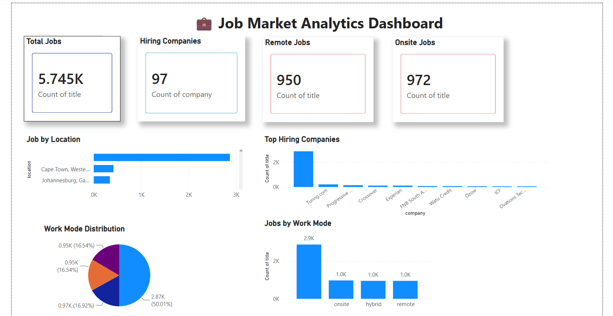
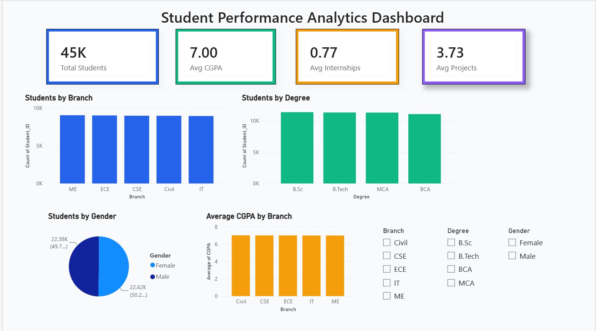

# Data Analytics Portfolio

Hi, I'm Mahi Jadhav.

Computer Science Engineering graduate and aspiring Data Analyst with skills in SQL, Excel, Power BI, and Data Visualization.

## Skills

* SQL
* Microsoft Excel
* Power BI
* Data Visualization
* Dashboard Development

## Projects

### Student Performance Analytics Dashboard

* Built using Power BI and Excel
* Created KPI cards and interactive filters
* Analyzed student performance metrics

### Job Market Analytics Dashboard

* Analyzed 5,700+ Data Analyst job postings
* Visualized hiring trends and remote opportunities
* Built interactive Power BI dashboards

## Certifications

* Power BI Micro Course
* Data Visualization with Power BI
* Artificial Intelligence Program (Intel)

## Contact

LinkedIn: linkedin.com/in/mahijadhav
GitHub: github.com/mahie06
## Dashboard Screenshots

### Job Market Analytics Dashboard

### Student Performance Analytics Dashboard

